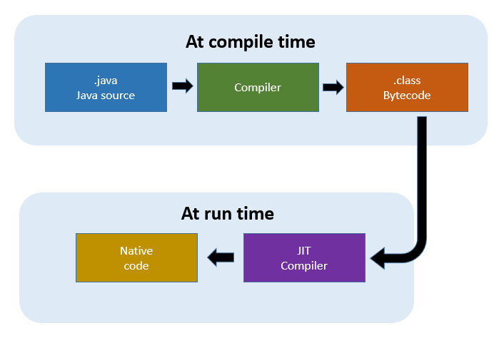

# Langage compilé versus langage interprété

Tous les langages de programmation ne fonctionnent pas de la même façon que ce soit par leurs règles, leur syntaxe, mais aussi la façon dont le code est exécuté par la machine.

On peut trouver deux catégories de langages : les langages interprétés et les langages compilés. Il existe d'autres langages comme le Java qui se situe plutôt entre les deux. 

## Langage compilé (AOT : Ahead of Time compilation)


Lorsqu'on écrit du code dans un langage spécifique, celui-ci est stocké dans un fichier dans un format également spécifique, par exemple en C, le code est écrit dans une fichier ***\*.c*** . Ensuite pour pouvoir exécuter le code par la machine il nécessité deux étapes:

- Etape de compilation
- Etape d'exécution

La première étape consiste à transformer un code écrit en langage haut niveau comme le langage c en un langage bas niveau comme le langage binaire en passant par un compilateur. En d'autres mots, l'idée est de prendre un ensemble de fichiers contenant le code source, de le passer à un compilateur qui va transformer l'ensemble du code en langage machine qui sera directement exécutable par le processeur. 

> Comme il existe plusieurs catégories de processeurs, le compilateur va produire un langage machine spécifique à la machine sur laquelle le code a été compilé. 

En sortie, le compilateur va produire un exécutable avec à côté potentiellement des librairies nécessaires au fonctionnement de l'exécutable. Une librairie est un ensemble de fonctions réutilisable. 

La seconde étape qui est l'exécution consiste simplement à lancer la première instruction contenu dans l'exécutable (***voir cours sur les instructions échangés entre RAM et processeur***).

## Langage interprété


Un langage interprété, contrairement au langage compilé, est le fait de lire chaque instruction et de l'exécuter à la volée. Il n'y a donc pas de transformation globale du code source en langage machine. Ces opérations sont réalisées via un interpréteur comme par exemple le langage python. Exécuter du code python n'est pas possible si aucun interpréteur Python n'est installé.

Un des avantages des langage interprétables c'est qu'il est indépendant de la machine et donc des différents groupes de processeurs. Ils sont alors multi-plateformes puisque c'est seulement l'interpréteur qui va changer en fonction de la plateforme. 

Les langages compilés ont besoin de deux étapes, tandis que les langages interprétés n'ont besoin que d'une étape qui est l'exécution. Il suffit donc d'écrire le code source et de l'exécuter avec un interpréteur.

## Langage Java : un langage compilé/interprété 

Le langage Java, mais aussi d'autres langages comme le C# sont des langages qui ne rentrent pas dans une catégorie spécifique puisqu'ils combinent les avantages des deux mécanisme. 



En Java, le mécanisme se déroule de la manière suivante:

- Le code source, stocké dans des fichiers *.java sont envoyés à un traducteur (translator) qui va transformer le code source en un langage intermédiaire appelée ***Bytecode***. On pourrait voir le traducteur également comme un compilateur puisqu'une transformation s'opère. Cette première étape de traduction permet notamment de faire des vérifications, des optimisations et une simplification du code source en une série d'instructions plus simple (proche du langage assembleur) seulement compréhensible par un interpréteur java.

- Le code source stocké dans des fichiers ***\*.class*** en ***Bytecode*** est ensuite lu par un interpréteur java souvent appelé machine virtuel Java. 

> C'est pour cela qu'un environnement Java doit être installé sur la machine, sinon le code ne pourrait pas être interprété. 

L'interprétation dans une machine java est particulière car elle fait deux choses en même temps:

- Elle va lire une instruction du code intermédiaire 
- Compiler l'instruction (ou la traduire) en langage machine
- Exécuter l'instruction
- Passer à l'instruction suivante

C'est un mécanisme appelé "***Just In Time compilation***" (**JIT**) qui permet de compiler à la voler des instructions tout en les exécutant. L'un des gros avantages du JIT, c'est que le langage intermédiaire peut-être modifié afin de l'optimiser au mieux à chaque instruction lue.

## Exemple d'optimisations avec le JIT

### Les conditions

Version non optimisée

```java
private static int isOpt(int x, int y) 
{
	int veryHardCalculation = 0;

	if (x >= y) 
    {
		veryHardCalculation = x * 1000 + y;
	} 
    else 
    {
		veryHardCalculation = y * 1000 + x;
	}
	return veryHardCalculation;
}
```

Version optimisée:

```java
private static int isOpt(int x, int y) 
{
	int veryHardCalculation = 0;

	if (x < y) 
    {
		// this would not require a jump
		veryHardCalculation = y * 1000 + x;
		return veryHardCalculation;
	} 
    else 
    {
		veryHardCalculation = x * 1000 + y;
		return veryHardCalculation;
	}
}
```

### Les boucles

Version non optimisée:

```java
private static double[] loopUnrolling(double[] vector1) 
{
	double[] result = new double[vector1.length];

    for (int j = 0; j < vector1.length; j++) 
    {
        result[i] += vector1[j] * vector1[j];
    }

	return result;
}
```

Version optimisée:

```java
private static double[] loopUnrolling2(double[] vector1) 
{
	double[] result = new double[vector1.length];

    result[0] += vector1[0] * vector1[0];
    result[1] += vector1[1] * vector1[1];
    result[2] += vector1[2] * vector1[2];

	return result;
}
```

##  Notes additionnelles

 Les langages ne sont pas dépendants de comment ils vont être exécuté plus tard, ce qui signifie que l'on peut tout autant utiliser un compilateur ou un interpréteur ou une machine virtuelle pour un même langage. 

## Références

https://en.wikipedia.org/wiki/Ahead-of-time_compilation

https://en.wikipedia.org/wiki/Just-in-time_compilation

https://dzone.com/articles/java-on-steroids-5-super-useful-jit-optimization-t